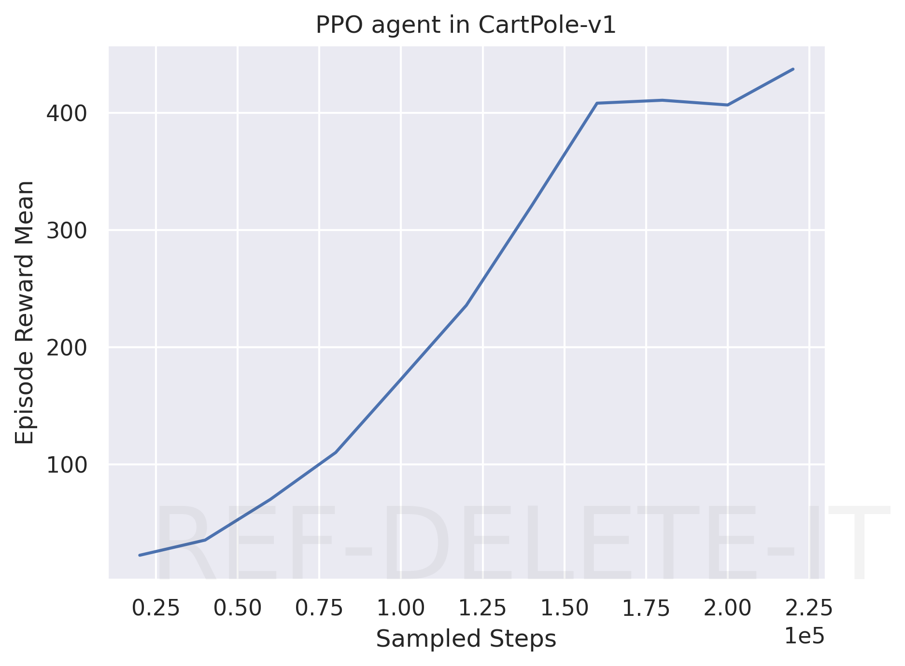

# Assignment 3 of CS260 2023 Fall

**NAME:** [TODO]

**UID:** [TODO]

## Learning curves of TD3

### TD3 in Pendulum-v1

20 points

[TODO]

### TD3 in MetaDrive-Tut-Hard-v0

20 points

[TODO]

## Learning curves of PPO

### PPO in CartPole-v1

20 points

[TODO: Replace your figure]

### PPO in MetaDrive-Tut-Hard-v0

20 points

[TODO: Replace to your figure]

## Generalization Experiment

In this section, you need to draw one figure
whose X-coordinate represents "the number of training scenes" and 
Y-coordinate represents "the episodic reward".

We expect two lines in the figure, showing the final training performance and 
the test performance varying with the number of training scenes. 

Choosing one algorithm, you should train agents in `MetaDrive-Tut-[1,5,10,20,50,100]Env-v0` environments and test all agents in `MetaDrive-Tut-Test-v0`.

### The generalization curves

(20 points)

[TODO]

